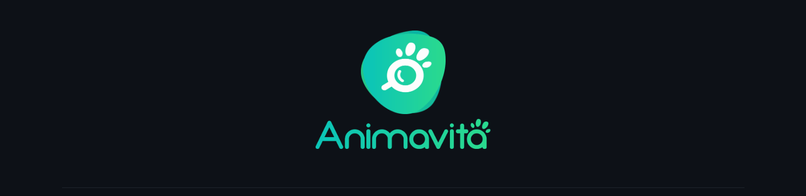

# Projeto com README
Projeto de teste com um arquivo README.



## Tecnologias utilizadas
- HTML
- CSS
- JS

## Como utilizar
Clone o projeto:
```
git clone <url>
```
Acesse a pasta do projeto:
```
cd repositorio-com-readme
```